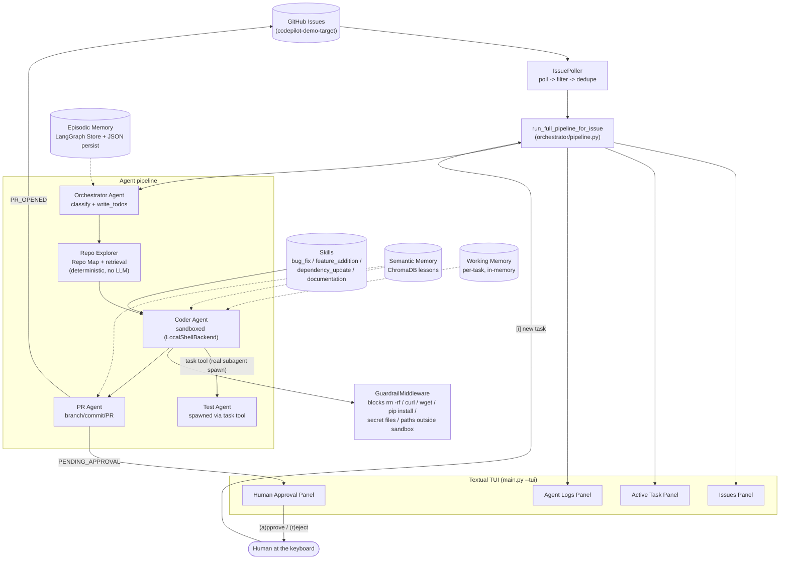

# CodePilot

A multi-agent, terminal-based AI coding platform that polls a GitHub repo
for open issues, plans and implements fixes with a sandboxed Coder agent,
verifies them with a Test agent, and opens pull requests — with
human-in-the-loop approval on risky operations.

Built for the AI Engineering Bootcamp capstone (Assignment 01). See
[BUILD_PLAN.md](BUILD_PLAN.md) for the full phase-by-phase build log,
including every place the real installed libraries diverged from the
assignment's pseudo-code and why each substitution was made.

- **Demo target repo:** [codepilot-demo-target](https://github.com/SHIVAAKARTHIK/codepilot-demo-target) — a tiny CLI seeded with 4 real issues, one per Skill category, live and `ai-assignable`
- **Demo video:** _add your recording link here before submitting_
- **Example generated PR:** _add a link to a real PR opened by CodePilot here_

---

## Quickstart

```bash
git clone https://github.com/SHIVAAKARTHIK/codepilot-agent.git
cd codepilot-agent
python -m venv .venv
.venv\Scripts\activate          # Windows; use `source .venv/bin/activate` on macOS/Linux
pip install -r requirements.txt
copy .env.example .env          # then fill in the values below
```

### Environment variables

| Variable | Required for | Notes |
|---|---|---|
| `LLM_PROVIDER` | everything | `openai` (default) or `anthropic` — selects which key below is used |
| `OPENAI_API_KEY` | everything, if `LLM_PROVIDER=openai` | from platform.openai.com |
| `ANTHROPIC_API_KEY` | everything, if `LLM_PROVIDER=anthropic` | from console.anthropic.com |
| `CODEPILOT_MODEL` | everything | optional override; defaults to `gpt-4o` (openai) / `claude-sonnet-5` (anthropic) |
| `GITHUB_TOKEN` | GitHub polling/PR features | a PAT with `repo` scope, against the **demo target** repo, not this one |
| `GITHUB_REPO` | GitHub polling/PR features | `owner/codepilot-demo-target` |
| `POLL_INTERVAL_MINUTES` | polling loop | default `5` |
| `COMPLEXITY_THRESHOLD` | issue filtering | default `6` (1–10 scale) |
| `REPO_MAP_TOKEN_BUDGET` | Repo Explorer | default `4000` |
| `MAX_CODER_RETRIES` | Coder retry loop | default `3` |

### Running it

```bash
# Sanity check: LLM connectivity only
python main.py --smoke-test

# Launch the TUI - demo mode by default, no GitHub needed beyond the LLM key
python main.py --tui

# TUI against your real GitHub repo (needs a local checkout - see below)
python main.py --tui --live --repo-path /path/to/your/local/codepilot-demo-target

# Run the test suite
.venv\Scripts\python.exe -m pytest tests/ -q
```

Every phase also has its own standalone `--phaseN-check` command
(`--phase1-check` through `--phase7-check`) that exercises just that
phase's piece in isolation — see [BUILD_PLAN.md](BUILD_PLAN.md) for what
each one proves and how to run it.

---

## Architecture



### Component map

| Spec component | Code | Real vs. spec |
|---|---|---|
| Orchestrator + issue polling | [`orchestrator/agent.py`](src/codepilot/orchestrator/agent.py), [`orchestrator/poller.py`](src/codepilot/orchestrator/poller.py) | GitHub access via `PyGithub` directly, not `langchain_community`'s `GitHubToolkit` — see [deviation note](#deviations-from-the-assignments-pseudo-code) |
| Repo Explorer + Repo Map | [`repo_explorer/`](src/codepilot/repo_explorer/) | Deterministic (`ast`/regex), not LLM-driven — faster, free, reproducible |
| Coder + sandbox + guardrails | [`coder/`](src/codepilot/coder/) | `FilesystemPermission`, not the spec's `Permission(path=,access=)` |
| Skills system | [`skills/`](src/codepilot/skills/) | Structured `Skill` objects per spec; also renders to deepagents' native `SKILL.md` format |
| Memory (3 tiers) | [`memory/working.py`](src/codepilot/memory/working.py), [`memory/episodic.py`](src/codepilot/memory/episodic.py), [`memory/semantic.py`](src/codepilot/memory/semantic.py) | All 3 implemented |
| Test Agent | [`test_agent/`](src/codepilot/test_agent/) | Real `CompiledSubAgent`, spawned by the Coder via the `task` tool — the one place in the pipeline using genuine nested subagent spawning |
| PR Agent + HITL gates | [`pr_agent/`](src/codepilot/pr_agent/) | Git Data API for one atomic commit, not one commit per file |
| TUI | [`tui/`](src/codepilot/tui/) | Real pause-and-resume for the PR Agent's gates (blocking `threading.Event`, resolved by an actual keypress) |
| Full pipeline glue | [`orchestrator/pipeline.py`](src/codepilot/orchestrator/pipeline.py) | Ties every phase's pieces into one run, driving the real `TaskStateMachine` |

---

## Deviations from the assignment's pseudo-code

Each of these was found by reading the *installed* library source directly
rather than assuming the spec's pseudo-code matched the real API. Full
detail and reasoning for each is in [BUILD_PLAN.md](BUILD_PLAN.md).

1. **GitHub integration is `PyGithub` directly, not `GitHubToolkit`.** The installed `langchain-community`'s `GitHubAPIWrapper` supports *only* GitHub App authentication — no personal-access-token path exists at all. Standing up a GitHub App just to poll one demo repo was disproportionate, so `github_client.py` wraps the same underlying library (`PyGithub`) with plain PAT auth instead. Required behavior is identical.
2. **`FilesystemPermission`, not `Permission(path=, access=)`.** The assignment's snippet doesn't exist in the installed `deepagents` version; the real primitive has a different (and more capable) shape.
3. **The Coder's sandbox security boundary is the custom `GuardrailMiddleware`, not path permissions.** `deepagents`' own `LocalShellBackend` docs say outright that path/`virtual_mode` restrictions provide "NO security with shell access enabled" — so the guardrail middleware intercepting `execute` calls by content is the actual defense here, exactly matching deepagents' own recommendation for this backend.
4. **Test Agent's pass/fail signal is deterministic (`pytest` + parsing), not the subagent's self-report.** The Test Agent (a real spawned subagent) writes/updates test files; a separate, code-based `run_test_suite()` actually decides pass/fail so the retry loop's correctness never depends on a model grading its own work.
5. **HITL gates refuse-and-surface rather than a full LangGraph `interrupt()`+checkpointer pause**, except for the PR Agent's 3 pre-flight gates, which the TUI *does* genuinely pause and resume via a real blocking `threading.Event` released by an actual keypress. Extending true mid-tool-call interrupts to the Coder's guardrail blocks was scoped out as materially larger risk late in the build for a marginal demo improvement — documented, not silently dropped.
6. **Skills are structured `Skill` dataclasses**, per the spec's explicit requirement — deepagents' own `SkillsMiddleware` wants directories of `SKILL.md` files instead. `Skill.write_skill_file()` can render one into that format too, kept compatible without depending on it.

---

## Known limitations

- The Coder's sandbox is a copy of only the files Repo Explorer judged relevant, not the full repo — for a change that touches files outside that set (e.g. an import the retrieval step missed), the Coder can't see them. A v2 would widen the copy to relevant files' direct imports.
- "After a PR opens successfully" (semantic memory) means "after `open_pull_request` returns `PR_OPENED`," not a confirmed GitHub *merge* — there's no webhook/polling here to observe an actual merge event.
- Issue complexity scoring is a word-count heuristic (`estimate_complexity` in `github_client.py`), not the LLM-scored 1–10 estimate described in the bonus "Issue triage scoring" challenge.
- `--live` TUI mode needs a manually-cloned local checkout of the target repo; there's no auto-clone step.
- Agent Logs streams pipeline-stage progress, not token-level deepagents streaming from inside each subagent's turn.

## Security decisions

- No API keys or secrets are committed; `.env` is gitignored, `.env.example` documents every variable.
- The Coder/Test Agent's sandbox never has network install ability (`pip install`, `curl`, `wget` are all blocked at the `execute` layer) and can't write outside its per-task temp directory or to `.env`/`*.secret`/`*.pem`/`*.key`/`*credentials*`-shaped filenames anywhere.
- All GitHub writes (branch/commit/PR) go through gates that must clear before any write happens — a pending gate means zero API calls were made, not a silent proceed.
- Merge conflicts (a non-fast-forwardable branch) are never auto-resolved; they set the task to `FAILED` and stop.

---

## Testing

```bash
.venv\Scripts\python.exe -m pytest tests/ -q
```

141 tests, no LLM or network calls required for the vast majority — the
handful that touch a local embedding model (`chromadb`'s bundled
`all-MiniLM-L6-v2`) download it once (~79MB) and are cached after that.
Key testing patterns used throughout, documented once here rather than
repeated per file:

- **Deterministic-first:** every LLM-dependent code path also has a
  fake-agent-driven test proving the *logic* (retry loops, guardrail
  blocking, approval gating, memory injection) independent of what any
  particular model run happens to do.
- **Live companions:** each phase also has a `main.py --phaseN-check`
  command that runs the real thing end-to-end against a live LLM, for
  manual verification and demoing.

---

## License / disclaimer

CodePilot is a fictional product built for learning purposes as part of a
bootcamp capstone.
